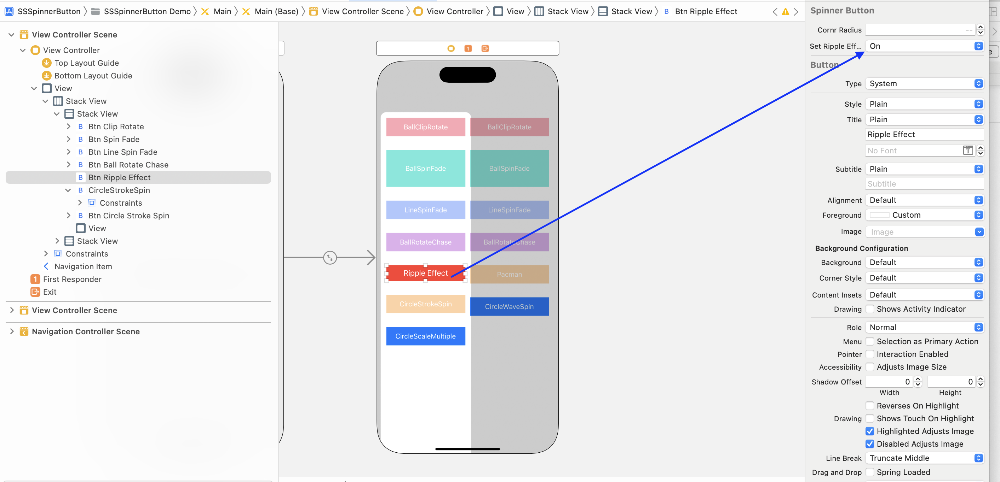

# SSSpinnerButton

SSSpinnerButton is a versatile library for iOS developers, written in Swift, that allows you to easily create and customize spinner buttons. With this library, you can add loading spinners to your buttons, providing visual feedback to your users while they wait for a process to complete. The library offers a wide range of customizable options, including spinner color, size as well as button text, font, and background color. SSSpinnerButton is simple to integrate into your existing projects and offers excellent performance, making it an essential tool for any iOS developer looking to enhance their user interface.

[![Swift Version][swift-image]][swift-url]
[![License][license-image]][license-url]
[![Platform][platform-image]][platform-url]
[![PRs Welcome][PR-image]][PR-url]

# Features!
  - Rounded button when spz̄inner active
  - Various spinner animations
  - Dynamic spinner size
  - Spinner with completion types (Success, fail, error)
  - Spinner with Ripple Effect
  - CocoaPods

# Requirements
  - iOS 10.0+
  - Xcode 9+
  > **Are looking for swiftUI? Try [SSSwiftUISpinnerButton](https://github.com/SimformSolutionsPvtLtd/SSSwiftUISpinnerButton) for a more conventional set of APIs.**

# Installation
 **CocoaPods**
 
- You can use CocoaPods to install SSSpinnerButton by adding it to your Podfile:

       use_frameworks!
       pod 'SSSpinnerButton'

-  
       import UIKit
       import SSSpinnerButton

**Carthage**

- Add `github simformsolutions/SSSpinnerButton` to your project's Cartfile

**Swift Package Manager**

- When using Xcode 11 or later, you can install `SSSpinnerButton` through [Swift Package Manager](https://swift.org/package-manager/) by going to your Project settings > `Swift Packages` and add the repository by providing the GitHub URL. Alternatively, you can go to `File` > `Swift Packages` > `Add Package Dependencies...`

**Manually**
-   Download and drop **SSSpinnerButton** folder in your project.
-   Congratulations!

# Usage example

-   In the storyboard add a UIButton and change its class to SSSpinnerButton
   
   
    **StartAnimation**

        button.startAnimate(spinnerType: SpinnerType.ballClipRotate, spinnercolor: UIColor.red, spinnerSize: 20, complete: {
            // Your code here
        })
   
    
    **StopAnimation**
      
        button.stopAnimate(complete: {
            // Your code here
        })
    
    **StopAnimation with completion types**
    
        button.stopAnimatingWithCompletionType(completionType: .success, complete: {
            // Your code here
        })
        
    **StopAnimation with completion types and back to defaults**
    
        button.stopAnimationWithCompletionTypeAndBackToDefaults(completionType: .fail, backToDefaults: true, complete: {
            // Your code here
        })
    **To give Default RippleEffect just set this "Set Ripple Effect" value to On**
     
     
     **To Change the RippleEffect**
    
        button.setRippleEffect(rippleEffectAnimationDuration: Double, initialOpacity: Double, rippleEffectColor: UIColor, rippleEffectPercent: Double, initialRippleEffectPercent: Double)

# Migration
**Version 3.0.1**
- This version requires Xcode 10.2 and Swift 5.0.

**Version 2.0.1**
- This version requires Xcode 10.1 and Swift 4.2.

## 🤝 How to Contribute

Whether you're helping us fix bugs, improve the docs, or a feature request, we'd love to have you! :muscle:

Check out our [**Contributing Guide**](CONTRIBUTING.md) for ideas on contributing.

## Find this example useful? ❤️

Give a ⭐️ if this project helped you!

## Check out our other Libraries

<h3><a href="https://github.com/SimformSolutionsPvtLtd/Awesome-Mobile-Libraries"><u>🗂 Simform Solutions Libraries→</u></a></h3>

## MIT License

This project is licensed under the MIT License - see the [LICENSE](LICENSE) file for details

    
[swift-image]:https://img.shields.io/badge/swift-5.0-orange.svg
[swift-url]: https://swift.org/
[license-image]: https://img.shields.io/badge/License-MIT-blue.svg
[license-url]: LICENSE
[travis-image]: https://img.shields.io/travis/dbader/node-datadog-metrics/master.svg?style=flat-square
[travis-url]: https://travis-ci.org/dbader/node-datadog-metrics
[codebeat-image]: https://codebeat.co/assets/svg/badges/C-ffb83f-7198e9a1b7ad7f73977b0c9a5c7c3fffbfa25f262510e5681fd8f5a3188216b0.svg
[codebeat-url]: https://codebeat.co/projects/github-com-vsouza-awesomeios-com
[platform-image]:https://img.shields.io/cocoapods/p/LFAlertController.svg?style=flat
[platform-url]:http://cocoapods.org/pods/LFAlertController
[cocoa-image]:https://img.shields.io/cocoapods/v/EZSwiftExtensions.svg
[cocoa-url]:https://img.shields.io/cocoapods/v/LFAlertController.svg
[PR-image]:https://img.shields.io/badge/PRs-welcome-brightgreen.svg?style=flat-square
[PR-url]:http://makeapullrequest.com
